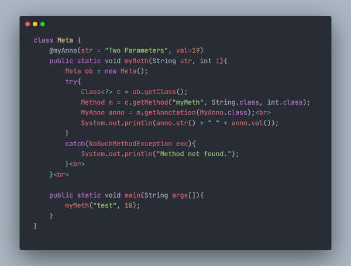
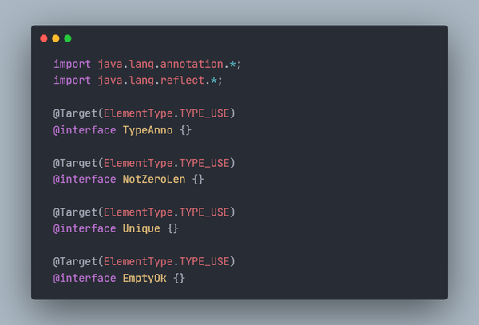
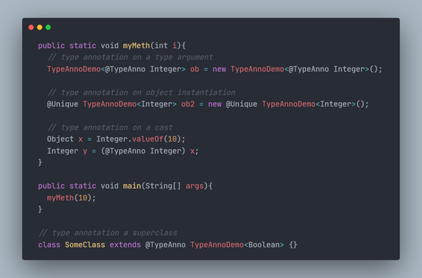

<p align="center">
  
</p>

<p align="center">
  
   
  
  
  
</p>


# Java Annotations: A Comprehensive Guide
  Discover the power of Java Annotations! <br>
  This repository explores how Annotations can <br>
  add metadata to your code, improve documentation, <br>
  and automate tedious tasks. <br>

  Perfect for Java novices and pros alike, <br>
  take your coding skills to the next level with Annotations.<br>


## Table of contents
  - Annotations: The Basic Concept
    - [The Idea](#the-idea)
    - [The Package](#the-package)
    - [The Usage](#the-usage)
    - [The Retention](#the-retention)
  - Annotations: Reflection and Annotation
    - [The Concept](#the-concept)
    - [Get the Class Object](#get-the-class-object)
    - [Get the Member Object](#get-the-member-object)
    - [Get the Annotation](#get-the-annotation)
    - [Example](#example)
    - [End-Note](#end-note)
  - Annotations: Annotation Varieties
    - [Annotations with Default Values](#annotations-with-default-values)
    - [Annotations as Markers](#annotations-as-markers)
    - [Annotations with Single Member](#annotations-as-markers)
    - [Built-In Annotation](#built-in-annotation)
    - [@Target Built-In Annotation](#@Target-Built-In-Annotation)
  - Annotations: Type Annotation
    - [The Concept](#the-concept)
    - [A Quick Look](#a-quick-look)
    - [Example](#example)
    - [End-Note](#end-note)
  - Annotations: Repeating Annotation
    - [The Idea](#the-idea)
    - [The Setup](#the-setup)
    - [The Access](#the-access)
    - [Example](#example)
  - Annotations: Annotation Restrictions


## Annotations: The Basic Concept
 ### The Idea
  JAVA provides a feature that enables you<br />
  to embed supplemental information into a source file.<br />
  This information is called `annotation`, another name `metadata`.<br />

  this information can be used by various tools<br />
  during development and deployment. for example,<br />
  annotations can be processed by a source code generator.<br />


 ### The Approach (declaring an annotation)
  As you would expect,<br />
  java implemets annotations from an object oriented perspective.<br />

  

  Notice the `@` that precedes the keyword `interface`<br />
  telling the compiler that an annotation type is being declared.<br />

  Notice the two members `str()` & `val()`.<br />
  all annotations consist solely of method declaration,<br />
  however, you don't provide bodies for this methods, JAVA implements them.<br />
  To you, this methods acts much like fields as you would soon see.


  ### The Package
  An annotation that you create, like the one above,<br />
  cannot include an extends clause. However, <br />
  all annotations types extend the `Annotation interface`.<br />

  This interface is declared within the `java.lang.annotation` package <br />
  it overrides `hashCode()`, `equals()`, `toString()` which are defined by Object. <br />
  it also specifies `annotationType()`, which returns a class object<br />
  that represents the invoking annotations<br />


  ### The Usage
  Once you have declared an annotation,<br />
  you can use it to annotate something. what things?

  you can annotate declarations. what declarations?<br />
  any type of declarations like `classes`, `methods`, <br />
  `fields`, `parameters`, `enum constats`, `other annotations`

  you can annotate `type use` which is a concept<br />
  we would delve into later on.<br />

  

  * Note that annotations precedes their declaration
  * Notice that name of the annotation is preceeded by `@`<br />
  and is followed by a parenthesized list of member initialization.
  * Notice that no parentheses follow `str` in this assignment.<br />
  this is how the annotation members are initialized.<br />
  In this context, <b><u>Annotations members look like fields</u></b>
  * Note that you can place one or more annotation on an element.


  ### The Retention
  There is what we call <b>annotation retention policy</b><br>
  <b>A Retention Policy determines at what point an annotition is deicarded.</b><br>

  JAVA defines three such policies by encapsulating them with the<br>
  `java.lang.annotation.RetentionPolicy` Enumerator. The constants are<br>
  `SOURCE`, `CLASS`, `RUNTIME`.

  ```java
  @Retention( RetentionPolicy.RUNTIME )
  @interface MyAnno {
  String str();
  int val();
  }
  ```

  With `SOURCE`,<br>
  annotations are retained only in the source file<br>
  and is dicarded during compilation.

  With `CLASS`<br>
  annotations are stored in the `.class file` during compilation.<br>
  However, it is not available through the JVM during run time.

  With `RUNTIME`<br>
  annotations are stored in the `.class file` during compilation.<br>
  and is available with JVM during runtime.<br>
  <b>RUNTIME offers the greatest annotation persistence</b>


## Annotations: Reflection and Annotation
 ### The Concept
  If an annotation specify a rentention policy of RUNTIME,<br>
  then they can be queried at runtime by any JAVA program <br>
  through the use of `reflection`.

  Reflection is the feature that enables information about<br>
  a class to be obtained at runtime. the `reflection API` is<br>
  contained in the `java.lang.reflect` package

  Obtaining annotations through Reflection Technique entails 3 steps.<br>
  You may want to get the annotation on a Class, or it members<br>
  e.g Methods, Constructors, Fields to do any of this,<br>
  you go through this three steps.<br>
  * Get the Class Object
  * Get its Member Object
  * Get its Annotation(s)


 ### Get the Class Object
  The first step to using reflection is to obtain an object <br>
  that represent the class whose annotations you want to obtain.<br>
  `Class` is one of JAVA built-in classes and is defined in `java.lang`.

  There are various way to obtain a `Class` Object,<br>
  One way is throu the getClass() method defined by `Object`<br>
  with signature `final Class<?> getClass()`<br>
  this method returns the class object that represent the invoking object.

  Another way is via a `class literal`. <br>
  this is used whenever the class object of a known class is needed.

  ```java
  class New { 
    // ... 
  }

  Class<?> c = New.class;
  ```

  Notice the `<?>`. this is from JAVA Generics Concept.<br>
  However, an understanding of generics is not needed<br>
  to grasp the fundamental principle of reflection<br>


 ### Get the Member Object
  After you have obtained a `Class Object`, you can use it's methods <br>
  to obtain information about the various items declared by the class,<br>
  it's fields, methods, constructors, annotations e.t.c

  To obtain the annotations associated with a specific item<br>
  declared within a class, <b><u>you must first obtain the object<br>
  that represents that item.</u></b>

  `Class` supplies (among others) the `getMethod()`,<br>
  `getField()`, `getConstructor()` methods. this methods returns object<br>
  of type `Method`, `Field`, `Constructor `

  for example, to get a method member, <br>
  it requires two arguments, the name of the method and<br>
  the class object representing the argument types of the method. 

  ```java
  // getMethod declaration signature
  Method getMethod(String methName, Class<?>...paramTypes)
  ```

  ```java
  Method m = c.getMethod("myMeth", String.class, int.class);
  ```

  if the method can't be found, NoSuchMethodException is thrown<br>
  do note, this is a checked exception.


 ### Get the Annotation
  From a Class, Method, Field, Constructor object,<br>
  you can obtain a specific annotation associated with that object<br>
  by calling the getAnnotation() on it.

  ```java
  <A extends Annotation> getAnnotation(Class<A> annoType)
  ```

  ```java
  Annotation[] get Annotations() 
  ```

  `annoType` is a Class Object that represent the annotation<br>
  in which you are interested. the methods returns a<br>
  reference to the annotation which is an object of annoType. <br>
  using this refernce, you can obtain the values <br>
  associated with the annotation's members.


 ### Example
 

 


 ### End Note<br>
  For you to perform this reflection technique you need<br>
  to access the reflection Api contain in the java.lang.reflect package.

  Actually, the methods `getAnnotation()` & `getAnnotations()` are defined<br>
  by the `AnnotatedElement interface` which is defined by `java.lang.reflect`.

  This interface supports reflection for annotations<br>
  and is implrmented by the classes `Method`, `Field`,<br>
  `Constructor`, `Class`, `Package` among others.

  in addition to those two, AnnotatedElement also defines several methods
  ```java
  // returns all non-inherited annotations
  Annotations[] getDeclaredAnnotations()
  ```
  ```java
  // returns true it the annotation is present
  default boolean isAnnotationPresent(Class<? extends Annotation> annoType)
  ```


## Annotations: Annotation Varieties
 ### Annotations with Default Values
  ```java
  @Retention(RetentionPolicy.RUNTIME)
  @interface MyAnno {
      String str() default "Testing";
      int val() default 9000;
  }
  ```

  You can give annotation member default values that will be used <br>
  if no value is specified when the annotation is applied.

  ```java
  // with no value
  @MyAnno()

  // with value
  @MyAnno(val=20)
  ```


 ### Annotations as Markers
  Marker annotation is a special kind tha contains no members.<br>
  Its sole purpose is to mark an item. Thus its presence<br>
  as an annotation is sufficient.

  ```java
  @Retention(RetentionPolicy.RUNTIME)
  @interface MyAnno{}
  ```

  The Best way to determine if a marker annotation is present<br>
  is to use the method `isAnnotationPresent()` defined by<br>
  the `AnnotatedElement`.


 ### Annotations with single member
  Single member annotations contains only one members.<br>
  It works like a normal annotation except that <br>
  it allows a shorthand form of specifying the value of the member.

  ```java
  // declaration
  @Retention(RetentionPolicy.RUNTIME)
  @interface MySingle {
      int value();
  }

  // usage
  @MySingle(100)
  ```
  you can use the single-value syntax when applying an annotation<br>
  that has other members, but those other members must all have default values.


 ### Built-In Annotations
  there are many built-in annotations<br>
  most are specialized , but Nine are general purpose

  Four are imported from `java.lang.annotations`<br>
  `@Retention`, `@Documented`, `@Target`, `@Inherited`

  Five are included in `java.lang`<br>
  `@Override`, `@Deprecated`, `@FunctinalInterface`, <br>
  `@SafeVarargs`, `@SuppressWarning`

  Visit [Built-In-Annotations](./Extra-Notes/Built-In-Annotations.md) for more info on each of them.


 ### @Target Built-In Annotation
  we would talk about the @Target annotation here,<br>
  because you will need it to understand the coming concept.

  it is designed to be used only as an annotation to another annotation.<br>
  it specifies the `type` of the items <br>
  to which an annotation will be applied.

  for example it informs that the declaration an annotation <br>
  must be applied to is a constructor or method e.t.c

  ```java
  @Target(ElementType.Method)
  @interface Recommended {}
  ```

  @Target takes one argument, a constant or an array of constants.<br>
  this constants are of the `ElementType enumeration`<br>
  some example of this constants are `ANNOTATION_TYPE`,<br>
  `CONSTRUCTOR`, `FIELD`, `METHOD`, `TYPE`, `TYPE_USE`, `TYPE_PARAMETER`


## Annotations: Type Annotation
 ### The Concept
  Annotations were originally allowed only on declarations however, <br>
  for modern versions of JAVA Annotatins can also be specified <br>
  in most cases in which a type is used.

  For Example, You can Annotate:
  * the return type of a method
  * the type of `this argument` of a method
  * a cast
  * array levels (2D, 3D)
  * an inherited class
  * a `throws` clause
  * generic types (generic type parameter bonds & generic type argument)

  Type annotations are important because they enable tools <br>
  to perform additional checks on code to help prevent errors.<br>
  Understand that, as a general rule, <br>
  javac will not perform these checks itself.


 ### A Quick Look
  Type Annotation must include the `@Target` annotation,<br>
  specifying the constants `ElementType.TYPE_USE` as a target

  ```java

  @Target(ElementType.TYPE_USE)
  @interface TypeAnno { }

  ```
  A Type Annotation applies to the type that the annotation precedes.<br>
  check out how we make @TypeAnno annotate the NullPointerException in the throws clause.

  ```java

  void myMeth() throws @TypeAnno NullPointerException { ... }

  ```

  Check out how we make `@TypeAnno` annotate the `this argument` of a method.<br>
  `this` is an implicit argument to all instance methods<br>
  and it refers to the invoking object. by explicitly <br>
  declaring it, you can now annotate its type.

  ```java

  class SomeClass {
    int myMeth( @TypeAnno SomeClass this, int i){
      ...
    }
  }

  ```

  Note that if you do explictly declare `this`, it must be the first parameter.


 ### Example
  

  

  

  

  
 ### No Ambiguities
 
  Pay attention to this two method declaration
  ```java
    // type annotate the return type
    public @TypeAnno Integer f2(intj, intk) { 
      return j+k; 
    }

    // annotate the method declaration
    public @Recommended Integer f3(String str){
      return str.length() / 2; 
    }
  ```
  Notice that in both cases, <br>
  an annotation precedes the method's return type (Integer)<br>
  however, the two annotations annotate two different things.

  The differnce is in the specification of the `@Target` annotation.<br>
  `@TypeAnno` annotate f2's return type because<br>
  its targe specified `ElementType.TYPE_USE`.<br>
  `@Recommended` annotates the method declaration because<br>
  it has it's taget specified as `Element.METHOD`.<br>

  Therefore, the target specification


 ### End-Note
  Therefore, the target specification is used to <br>
  eliminate what, at first glance appears to be an ambiguity<br>
  between the annotation of a method declaration<br>
  and the annotation of a method type.


## Annotations: Repeating Annotation
 ### The Idea
  the idea of Repeating Annotation is to have two or more objects<br><br>
  of an annotation class and attach them all to a declaration
  ```java
  @MyAnno(str="first annotation", val=-1)
  @MyAnno(str="Second annotation", val=100)
  public static void myMeth(String str, int i) {
    //...
  }
  ```


 ### The Setup
  One way JAVA implements this is that you would create two different annotations
  * Annotation A
  * Annotation B

  if you repeate Annotation A on a declaration, JAVA would store <br><br>
  all objects of the annotation you added to the declaration in an array variable. 

  You would separately create Annotation B which will only have one member,<br><br>
  which would be the the array variable. have a look
  ```java
  @interface MyRepeatedAnnos{
    MyAnno[] value();
  }
  ```

  Lastly, we need to connect Annotation B  to Annotation A<br>
  stating that it will be a container to store all Annotation A<br>
  if it is repeated on a declaration.
  ```java
  @Repeatable( MyRepeatedAnnos.class )
  @interface MyAnno {
    String str() default "Testing";
    int val() default 9000;
  }
  ```
  This is where the Built-in Annotation `Repeatable` comes in.<br>
  it specifies a particular annotation (Annotation A) is repeatable,<br>
  and also specifies the container annotation (Annotation B).


 ### The Access
  We access the repeated annotation using a method such as `getAnnotation()`<br>
  In this case, we use the container annotation (Annotation B),<br>
  not the repeatable annotation itself (Annotation A)

  ```java
    ...
    Annotation anno = m.getAnnotation(MyRepeatedAnnos.class);
    ...<br><br>
  ```

  Another way to obtain the repeated annotations <br>
  is to use one of the methods in AnnotatedElement<br>
  that can operate directly on a repeated annotation

  these are `getAnnotationByType()` and `getDeclaredAnnotationsByType()` with signature 
  `default <T extends Annotation> T[] getAnnotationsByType(Class<T> annoType)`

  ```java
  Annotation[] annos = m.getAnnotationsByType(myAnnos.class);
  for (Annotation a:annos){
    System.out.println(a);
  }
  ```

 ### Example
  

  


## Annotations: Annotation Restrictions
  * No annotation can inherit another
  * All method declared by an annotation must be withous parameters
  * All methods declard by an annotation must return one of the following
    * A primitive type
    * An object of type `String` or `Class`
    * An object of an `enum` type
    * An object of another annotation type
    * An Array of a legal type
  * Annotations cannot be generic
  * Annotation methods cannot specigy a `throws` clause


